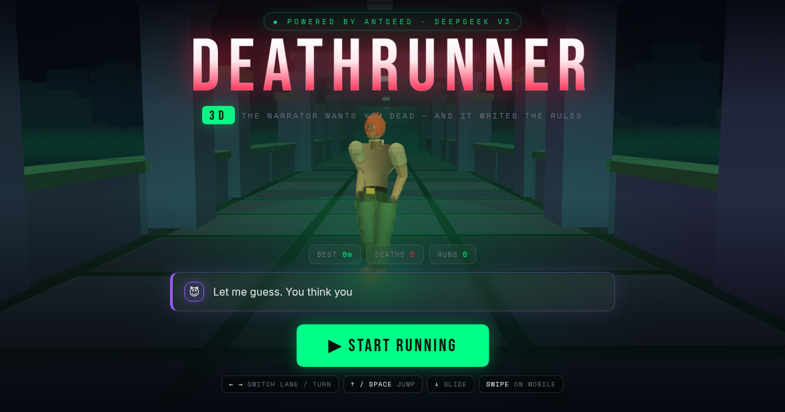
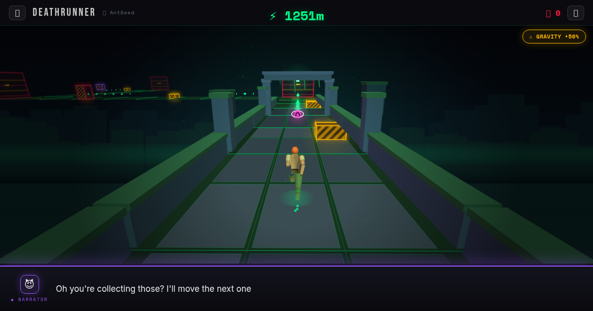
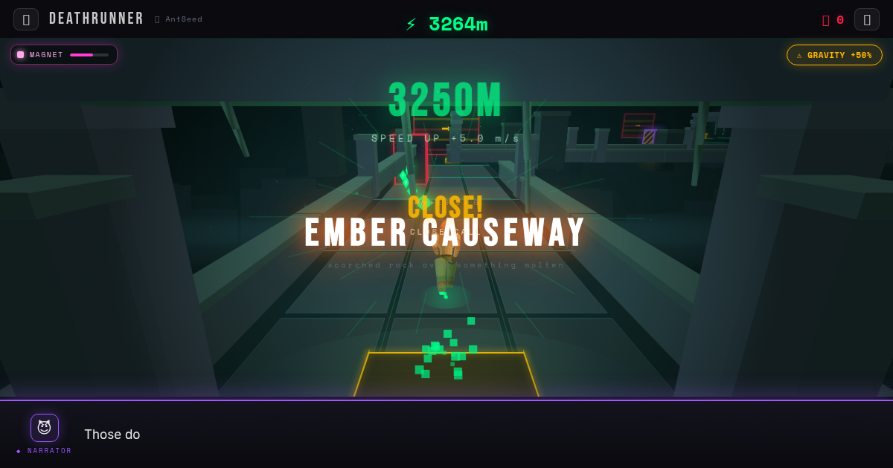
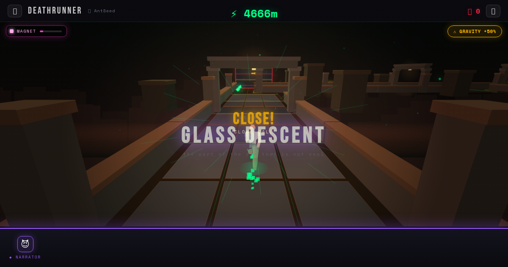
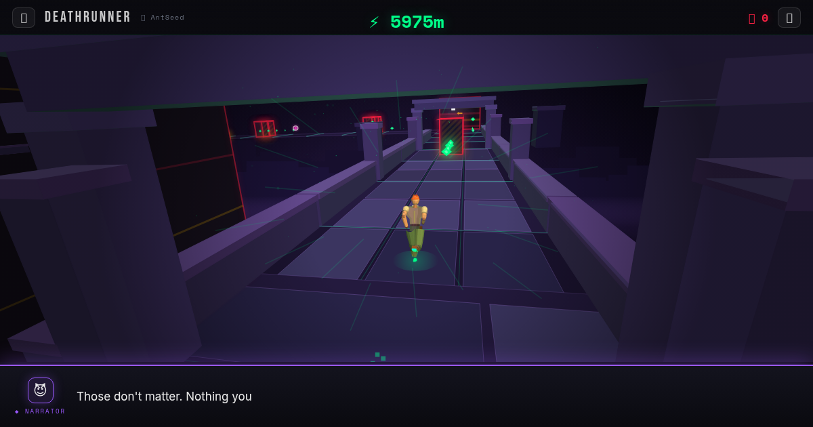

# DEATHRUNNER 3D

**A behind-the-back endless runner where the narrator is an AI that watches how you play, says your bad habits out loud, and then rewrites the rules to kill you specifically.**



One HTML file. No build step, no dependencies, no frameworks, no WebGL — the entire 3D engine is hand-written on a 2D canvas.

**[▶ Play it](index.html)** · [Classic 2D version](classic-2d.html)

---

## What it is

Three lanes, forced 90° junction turns, and a corridor that gets faster the longer you survive. Miss a turn and you paint yourself across the backstop. The twist is the narrator: it isn't a list of random taunts on a timer. It profiles you.

> *"You've spent 91% of this run in the LEFT lane. You have a favourite. Now so do I."*
> — then it fills that lane with obstacles.

> *"80 jumps. 75 of them at absolutely nothing. Gravity has notes."*
> — then it makes jumping cost you points.

> *"That's 4 deaths to a beam. At this point it's a relationship."*

---

## Features

### The narrator actually watches
A `PlayerProfile` tracks time-per-lane, lane changes, jumps vs *pointless* jumps, slides vs pointless slides, near misses and combo peaks, fragments collected vs ignored, clean/late/missed turns, which power-ups you lean on, and a session ledger of deaths by cause and retries.

Eight **tells** turn those numbers into a line *and* a punishment:

| Tell | Trigger | What it does to you |
|---|---|---|
| Lane bias | ≥58% of the run in one lane | Injects obstacles into **that exact lane** |
| Jump spam | >50% of ≥12 jumps hit nothing | Applies `JUMP_COST` |
| Hoarder | 22+ fragments collected | Cuts fragment spawns for 13s |
| Coward | 40s with zero near misses | Applies `SPEED_UP` |
| Show-off | x4+ close-call streak | Applies `DOUBLE_OBSTACLES` |
| Late turner | >60% of turns left to the last second | Plants something just past the next corner |
| Crutch | 3+ power-ups used | Cuts off fragments |
| Same death | 3+ deaths to one cause | Injects that exact hazard again |

Targeted lines cost nothing — no API call, no latency. When a live model *is* connected, the whole profile goes into its context and the system prompt tells it to quote your real numbers back at you.

### Four biomes
The world re-skins itself every 1500m, cross-fading every colour it draws with over 3.5 seconds.

| | Biome | |
|---|---|---|
|  | **SUNKEN TEMPLE** | moss, stone and old green light |
|  | **FLOODED CISTERN** | black water and drowned marble |
|  | **EMBER CAUSEWAY** | scorched rock over something molten |
|  | **GLASS DESCENT** | the part of the run that is not real |

Sky gradients, horizon glow, parallax skylines, mist, fog, mortar, five slab tones, seams, rails, capstones, pillars, arches, lintels, distant towers, lanterns, vines — and the scene's back-light spill colour — all come from the biome table.

### The music follows the world
There are no audio files. The soundtrack is four live Web Audio layers — a sub bass you feel rather than hear, an LFO-swept drone, a filtered noise bed and a sparse arpeggio through a convolution reverb — and each biome **retunes the running synth** over the same 3.5s the visuals cross-fade:

| Biome | Drone | Noise bed | Arpeggio |
|---|---|---|---|
| Sunken Temple | sawtooth 98 Hz | bandpass 900 Hz, airy | 70 BPM triangle, A minor pentatonic |
| Flooded Cistern | sine 73 Hz | lowpass 420 Hz, submerged | 52 BPM sine, G minor, 3.6s reverb |
| Ember Causeway | sawtooth 110 Hz, open filter | highpass 1.9 kHz, crackle | 96 BPM detuned square, phrygian |
| Glass Descent | triangle 131 Hz, high Q | bandpass 3.4 kHz, shimmer | 44 BPM sine, whole-tone, 4.2s reverb |

Phase intensity rides on top of all of it, pushing the drone up and the mix hotter as the narrator escalates.

### Power-ups and combos
| | Effect | Duration |
|---|---|---|
| **Shield** | Absorbs one lethal hit; the obstacle shatters instead of you | until used |
| **Magnet** | Drags fragments within 9.5m physically through the air into your hand | 9s |
| **Boost** | ×1.55 speed, invulnerable, ploughs straight through obstacles | 4.5s |

Jump a barrier or slide a beam that was in *your* lane and it scores as a **near miss** — `+12 × combo`, with a 3.2s window to chain the next one.

### Escalation — and staying fair while it escalates
Base speed 13.2 m/s with a per-phase ramp, plus a permanent **+0.45 m/s every 250m** (capped at +7.5). Around 3.7km you're doing 21 m/s.

The junction gate is expressed in **seconds, not metres**. A fixed 13-unit turn window gives you a comfortable 0.98s of warning at starting speed but only **0.31s at top speed** — below human choice-reaction time, for a mistake that kills you instantly. `turnWindowFor(speed)` scales the window so you always get ~0.95s, at any speed, and the obstacle-free run-up to each junction scales with it.

Committing to a turn also hands lane control back: the first press commits, and further presses steer again, so anything between you and the junction is still dodgeable.

### The engine
No WebGL. A hand-written 3D pipeline on `CanvasRenderingContext2D`:

- Perspective camera with yaw/pitch/roll, screen shake and a lane-lean bank
- Painter's-algorithm depth sorting with per-quad backface culling
- **Gouraud-ish smooth shading** — per-vertex normals, colours blended across each quad with a canvas gradient, so tubes and spheres read as curved instead of faceted
- A two-light rig: a warm key from the front-upper-left, a biome-coloured back-light, a floor bounce and a camera-side fill
- Primitive builders: `quad`, `tube` (with rings/bulge for muscle bellies), `box`, `sphere` (with a normal filter, for things like hair caps)
- Adaptive quality: quads under ~20px use a flat fill, under ~5.5px skip the outline stroke entirely

### The runner
Real 3D geometry, not flat shapes between projected joints — ~7.5-head proportions, IK legs, a full sprint cycle, take-off extension → apex tuck → reach → landing absorption on jumps, and a slide. Modelled on the Temple Run explorer: tan short-sleeve shirt with a collar, bare forearms with fingerless gloves, brown belt and gold buckle, hip pouch, olive trousers, cuffed boots, swept-back orange spikes, and a face with eyes, brows and a jaw.

---

## Accessibility

Reachable from **SETTINGS & ACCESSIBILITY** on the title screen, or **SETTINGS** while paused. Every choice is saved to this device and applies instantly.

| Setting | Options | Why |
|---|---|---|
| **Screen shake** | off / reduced / full | Camera kick on impacts — a common motion-sickness trigger |
| **Screen flashes** | off / reduced / full | Full-screen red/amber/green washes. **Turn off for photosensitivity** |
| **Extra motion** | off / on | Speed lines and drifting motes |
| **Colour** | green / cyan / high contrast | Green collectibles against red-amber hazards is the worst pairing for red-green colour blindness (~8% of men). **Cyan** moves the accent — score, fragments, seams, lane lines, power meters — to `#22D3FF`, which stays distinct from the red and amber danger colours under both deuteranopia and protanopia. **High contrast** uses white with brightened hazards |
| **Quality** | auto / low / high | Low draws fewer slabs, less ruin geometry and fewer motes |
| **Sound** | off / on | All audio is synthesised — there are no audio files |

Danger is never signalled by colour alone: every hazard also carries diagonal warning stripes, obstacles are silhouetted boxes, collectibles are diamonds, and junction turns are announced in text *and* with a floor chevron *and* an arrow on the backstop wall.

---

## Controls

| Action | Keyboard | Touch |
|---|---|---|
| Change lane / take a junction turn | `←` `→` | Swipe left / right |
| Jump | `↑` or `Space` | Swipe up or tap |
| Slide | `↓` | Swipe down |
| Pause | `P` or `Esc` | Pause button |

Left/right is context-sensitive: on a straight it changes lane, inside the junction window it commits to the turn.

---

## Running it

It's one file. Open `index.html` in a browser — that's it.

To serve it locally (recommended, so `localStorage` and fonts behave):

```bash
python3 -m http.server 8080
# then open http://localhost:8080
```

### Connecting a live narrator (optional)

The game ships fully playable **offline** — with no API configured it uses its built-in line banks plus the targeted-tell system, which is where most of the personality lives anyway.

To connect any OpenAI-compatible chat endpoint, you don't need to edit the file:

```js
// before the game script runs
window.DEATHRUNNER_CONFIG = {
  apiKey:   'sk-...',
  endpoint: 'https://your-gateway/v1/chat/completions',
  model:    'deepseek/deepseek-chat'
};
```

or from the console:

```js
localStorage.setItem('deathrunner_api_key',  'sk-...');
localStorage.setItem('deathrunner_endpoint', 'https://your-gateway/v1/chat/completions');
localStorage.setItem('deathrunner_model',    'deepseek/deepseek-chat');
```

The narrator expects strict JSON back:

```json
{ "text": "line", "action": "MOCK|LIE|RULE_CHANGE|ADD_OBSTACLE|REMOVE_OBSTACLE|TARGET_LANE|FOURTH_WALL|EMOTIONAL",
  "rule": "SPEED_UP", "addition": "BOULDER", "lane": "left" }
```

Requests time out after 3s and fall back to the offline banks, so a slow or dead endpoint never stalls the game.

> **Never ship a real API key in a public build.** Anything in the HTML is visible to every player. Put a server-side proxy in front of your provider and point `endpoint` at that.

---

## Deploying

**Vercel** — this repo is wired for it. `vercel.json` sets it up as a pure static deploy (no build command, no output directory) with sane cache headers, so every push to `main` ships.

**GitHub Pages** — Settings → Pages → Source: *Deploy from a branch* → `main` / root. No workflow needed for a static site like this.

**itch.io** — zip the folder and upload it as an HTML project, with `index.html` as the entry point. Suggested viewport: 1280×720, "fullscreen button" enabled.

**Netlify / Vercel / Cloudflare Pages** — drag the folder in. There's no build command and no output directory.

---

## Architecture

Everything lives in `index.html`, in this order:

```
CONFIG            constants, biome tables, narrator endpoint
UTILITIES         clamp / lerp / rand / pick / storage
SOUND MANAGER     Web Audio synthesis — no audio files
3D MATH           Camera, projection, fog, poly fills
MESH LAYER        lighting, quad / tube / box / sphere, drawMesh
FX                particles
TRACK             segment generation, junctions, obstacles,
                  fragments, power-ups, collision
RENDERER          sky, skyline, corridor, ruins, props, HUD-space effects
BODY + RUNNER     skeleton, mesh build, run / jump / slide animation
PLAYER PROFILE    habit tracking and the eight tells
NARRATOR          API client, fallback banks, targeted lines, actions
RULE ENGINE       live rule modifiers
SCORE MANAGER     scoring, persistence
UI                screens, HUD, banners, typewriter
INPUT + GAME      loop, camera rig, state machine
```

Persisted in `localStorage`: `deathrunner_best`, `deathrunner_deaths`, `deathrunner_runs`.

---

## Performance

Numbers below are 10×1-second samples during active play in headless Chrome on **SwiftShader — pure software rasterisation, no GPU at all**. Hardware canvas acceleration is several times faster; treat these as a worst-case floor, not what a player sees.

| Quality | median fps | range |
|---|---|---|
| High (desktop default) | 25 | 19–31 |
| Low | **31** | 24–33 |
| Low + motion off | 31 | 25–36 |

The whole frame is software-rasterised 2D canvas, so cost is dominated by **fill area**: the corridor tiles first, the character mesh second. `Low` therefore cuts draw distance from 24 to 15 tiles and drops the per-tile slab subdivision, outer towers, vines and distant pillars — about **+24%**, and it's the setting worth reaching for on a weak machine. Auto selects Low on mobile.

Two optimisations do most of the heavy lifting in `drawMesh`: quads under ~20px get a flat fill instead of a canvas gradient, and quads under ~5.5px skip their anti-seam outline stroke entirely. Together those were worth ~9 fps with no visible difference.

Memory and long-run behaviour were audited over a continuous 33km run: heap flat at 9.5 MB, segment/obstacle/fragment arrays all flat, **no fps drift** between the first and second half.

---

## Credits

Built as a single-file experiment in how much 3D you can get out of a 2D canvas, and how much personality you can get out of a narrator that actually pays attention.

Narrator powered by [AntSeed](https://antseed.ai) (DeepSeek V3) when connected, and by a large offline line bank when not.

## License

MIT — see [LICENSE](LICENSE).
